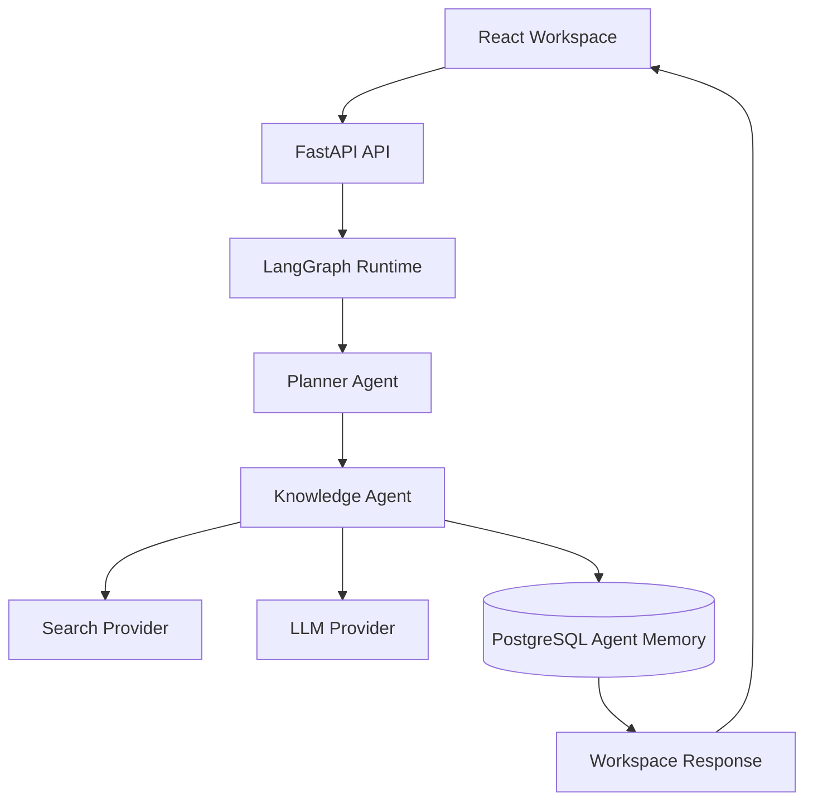
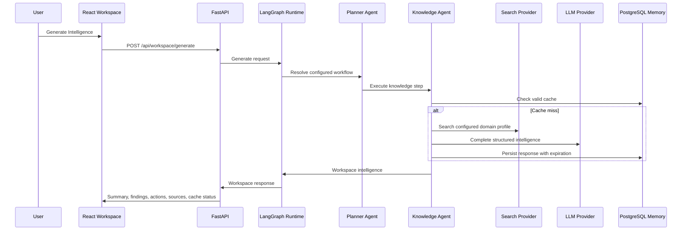

# Architecture

GrowthPilot AI v0.3.0 is a monorepo with a React frontend and FastAPI backend.

```text
React Frontend -> REST API -> FastAPI -> Service Layer -> Repository Layer -> Mock Data
```

The frontend never imports mock data. All application data is retrieved through REST endpoints. Backend repositories currently return mock data only, which keeps v0.3.0 focused on architecture rather than AI, integrations, or persistence.

## Backend layering

- API routers: HTTP contracts and dependency injection only.
- Services: business orchestration and future policy decisions.
- Repositories: data access. In v0.3.0 this is mock data; in v0.4.0 it can become PostgreSQL-backed.
- Schemas: Pydantic response models defining the REST contract.

## v0.4.0 readiness

SQLAlchemy and Alembic are installed and scaffolded so PostgreSQL models and migrations can be introduced without changing the API or frontend contracts.

## GPS-0004A Persistence Layer

GrowthPilot AI now uses PostgreSQL as the system of record for domains, knowledge items, and recommendations. FastAPI controllers depend on services, services coordinate business rules, and repositories contain SQLAlchemy persistence logic. Controllers do not execute SQL directly.

The primary flow is:

1. React Query calls the FastAPI `/api/*` endpoints.
2. FastAPI resolves a database session from `DATABASE_URL`.
3. Service classes call repository classes.
4. SQLAlchemy models map to PostgreSQL tables managed by Alembic.

The AI, LLM, external API, and recommendation-generation layers remain intentionally out of scope for this increment.

## GPS-0005 Agent Platform



The GPS-0005 workflow treats PostgreSQL as agent memory and cache, not as the primary knowledge source. The Planner selects a configured workflow, the Knowledge Agent checks memory, invokes replaceable providers when needed, stores structured intelligence, and returns a workspace response.


